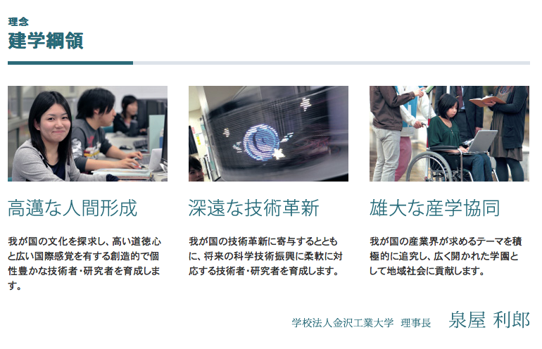

## 地方工業大学における
## 心理学研究と教育

伊丸岡 俊秀

金沢工業大学 心理情報学科

## 金沢工業大学

## 概要

- 学生
  - 学部学生数：6,909名（男/女：6,260/649)
  - 大学院生数：418名（363/55)
  - 石川県：21%, 北陸3県：36.5%
- 教員
  - 346名

## 学部構成

- 工学部
  - 機械・航空システム・ロボティクス
  - 電気電子・電子情報通信
  - 情報工学
- 情報フロンティア学部
  - メディア情報・経営情報・__心理情報__
- 環境建築学部
  - 建築デザイン・建築
- バイオ・化学
  - 応用化学・応用バイオ

## 大学院

- 工学研究科（修士・博士）
  - 機械工学・環境土木工学・情報工学・電気電子工学・__システム設計工学__・バイオ・化学・建築学・高信頼ものづくり・ビジネスアーキテクト・知的創造システム
- 心理科学研究科（修士）
- __臨床心理学__

## 心理情報学科

- 2004年設置
- 入学定員60名

## 教員構成

- 神宮英夫：感性工学・官能評価
- 近江政雄：視覚・感情
- 吉澤達也：視覚・色覚
- 田中吉史：記憶・創造性
- 石川健介：行動分析・発達障害
- 伊丸岡俊秀
- 渡邊伸行：表情認知・顔知覚
- 星野貴俊：視覚認知・精神病理

## 学科の教育目標

人の心についての興味・関心が高まっており、21世紀は「心の時代」といわれている。本学科では、この心のはたらきを科学的に捉えて、測定・評価する技術を修得して、人ともの、人と社会、そして人と人との適切な関係を構築できることを目指している。そこで、心理学と情報技術とを融合して、安全で、心地よく、楽しく使うことができる製品やシステムの企画・開発、人の心のはたらきに配慮したサービスの提案を行うことができる人材を育成する。

## カリキュラム

- [学科カリキュラム](./psychology-chart.pdf)

## 研究室運営

## 配属

- 3年後期に集中講義という形で研究室単位のゼミ
  - 実質的な研究室配属
- 4年次から研究室に所属
  - 別キャンパスでの活動開始
  - 60名を8研究室だが人数の傾斜あり

## ここ3年の卒論テーマ

## 2012年

- [タイヤの溝パタンの感性評価](./12okada.pdf)
- [タブレット端末による文章読解支援](./12ishimura.pdf)
- [日本語読解過程と視線停留](./12hayashida.pdf)
- [映像視聴環境と感情の動き](./12bushida.pdf)

## 2013年

- [情動画像の精神的負担を緩和するための効果的画像処理](./13sanada.pdf)
- [社会的場面に対する視線と不安特性](./13terasaki.pdf)
- [色のついた視覚的パタンの感性評価](./13hara.pdf)
- [タイヤ画像の奥行き判断](./13saiga.pdf)
- [プレパフォーマンスルーチン](./13futagami.pdf)
- [タイツの厚さの感性評価](./13mitani.pdf)

## 2014年

- [動作方向と感情語の記憶](./14okada.pdf)
- [スポーツ時のスキルと注意範囲](./14isobe.pdf)
- [集団に対する視線の計測](./14morita.pdf)
- [異性に対する視線の計測](./14nishio.pdf)
- [カラーバリエーションに対する視線の計測](./14fukuda.pdf)
- [社会的場面に対する視線と不安特性](./14saikawa.pdf)
- [閾下感情プライミングと単語色](./14maehama.pdf)
- [風景画像の感性評価と視線の動き](./14shimizu.pdf)
- [3D映像の時系列感性評価](./14nakamura.pdf)

## 受託研究

- 人による多寡があるが全学で見ると多い
- 伊丸岡の場合
  - ここ数年継続しているのが1件
  - 他に新規が2-3年に1件程度

## その他の研究

- 学内の心理系の教員との共同研究
  - 不安・発達障害関係の査定・介入手法開発 [1](https://kaken.nii.ac.jp/d/p/21330161.ja.html), [2](https://kaken.nii.ac.jp/d/p/21243040.ja.html), [3](https://kaken.nii.ac.jp/d/p/23730869.ja.html)
  - いじめの長期的影響に関する調査 [1](http://www.hpsj.org/journal/目次), [2](../2014JSEE/reveal.js/index.html)
- 学内の他分野との教員の共同研究
  - 3D映像の影響[1](https://kaken.nii.ac.jp/d/p/25280102.ja.html), [2](../2014HCS/index.html), [3](../2015AandC/index.html)
